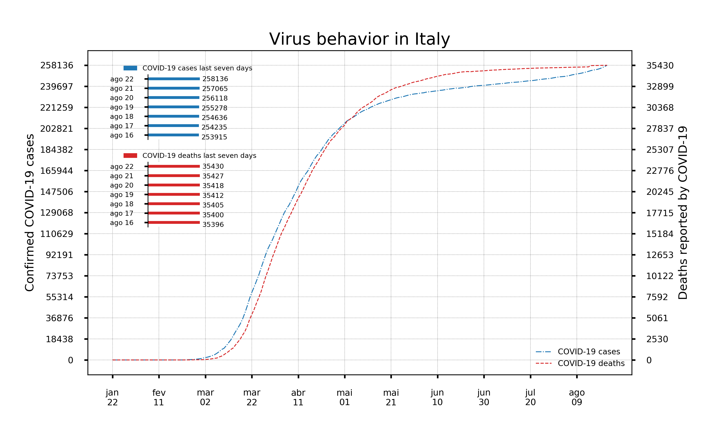
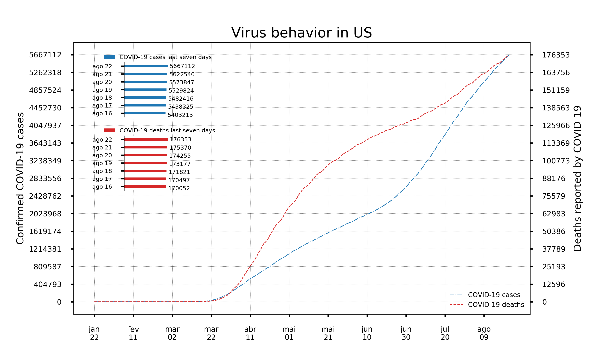
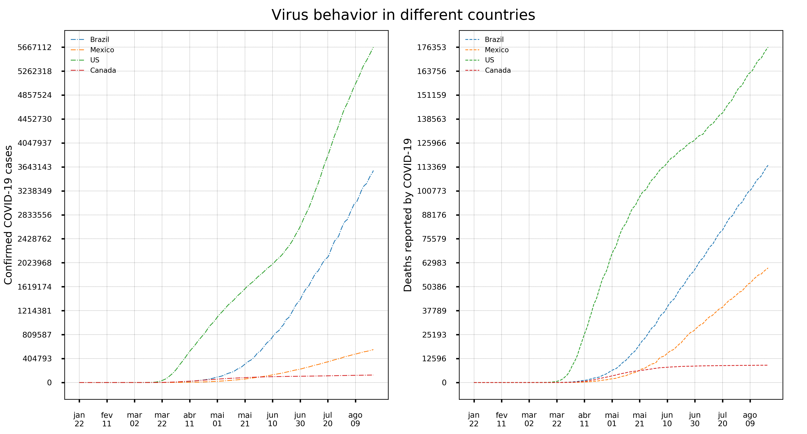
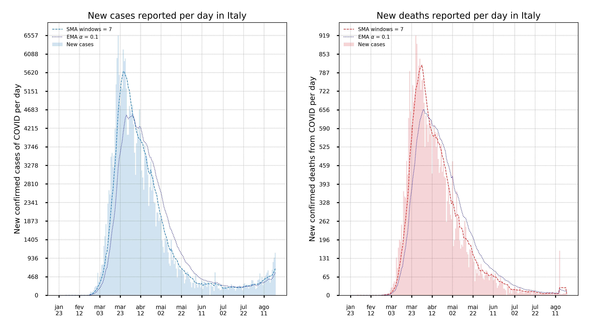
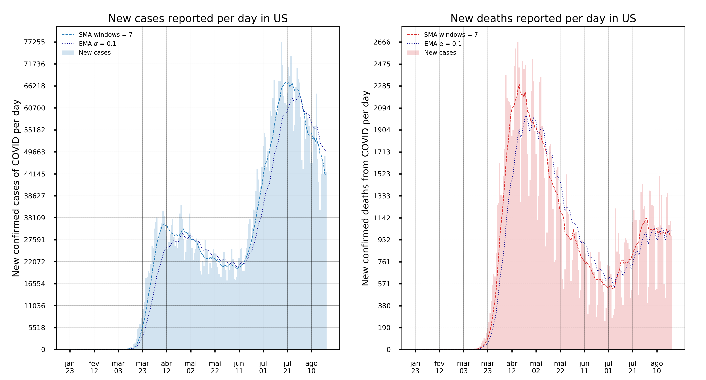
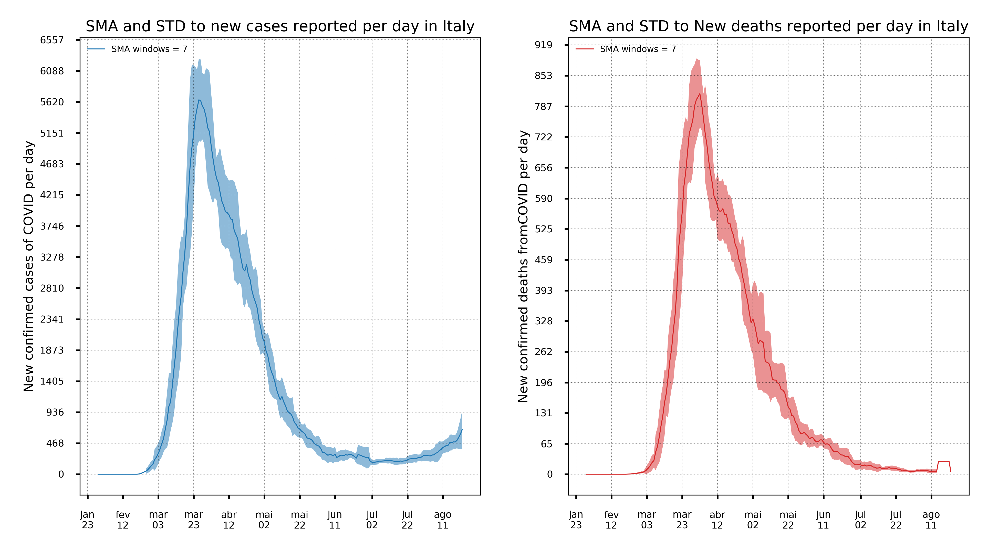
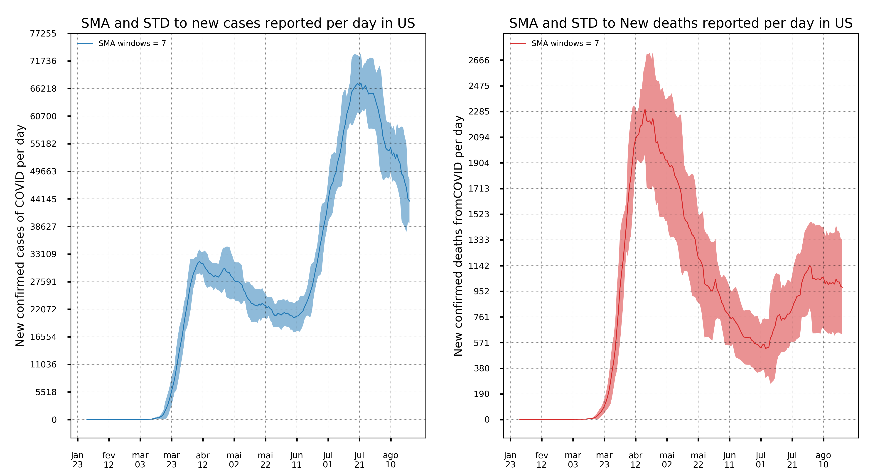

# Graphic Analysis COVID

> Code to perform a descriptive analysis of Virus COVID-19 in each country.

## Features.

- Code to perform a descriptive analysis of the virus behavior in different countries;

- The analysis is divided into confirmed cases of the COVID-19 virus and the deaths caused by this virus;

- The data used to perform the analyzes are those provided by [Johns Hopkins University](https://github.com/CSSEGISandData/COVID-19);

- The graphic analyzes performed are:

  - Virus behavior and evolution of cases of death by countries;
  - Comparison of confirmed cases of the virus and deaths caused by different countries;
  - The behavior of new cases of the virus daily with the moving average (simple moving average, SMA, and exponential moving average EMA);
  - The behavior of new deaths daily with the moving average (simple moving average, SMA, and exponential moving average EMA);
  - The behavior of the simple moving average (SMA) and standard deviation for new cases and confirmed deaths per day.

## Functions.

The code has seven functions, three functions are for data processing and four for analysis. These functions are:

- `data_preparation`: Function to load the data to be analyzed;

- `data_country`: Function to create a matrix with data of confirmed cases of COVID-19 and death by COVID-19;

- `data_per_day`: Function to calculate the newly registered cases of the COVID-19 virus and the newly registered deaths;

- `country_plot`: Function to plot the data of COVID-19 confirmed cases and deaths by COVID-19 in the same plot;

- `comparison_plots`: Function to compare the behavior of the COVID-19 virus in different countries;

- `new_cases_per_day`: Function to graph the new confirmed cases of the COVID-19 virus and the new deaths caused by the virus;

- `new_cases_per_day_fill_plot`: Function to graph the moving average and standard deviation for newly registered cases of COVID-19 and new deaths registered per day.

## Some results

### **`country_plot`**

 

### **`comparison_plots`**

### **`new_cases_per_day`**

 

### **`new_cases_per_day_fill_plot`**

 
